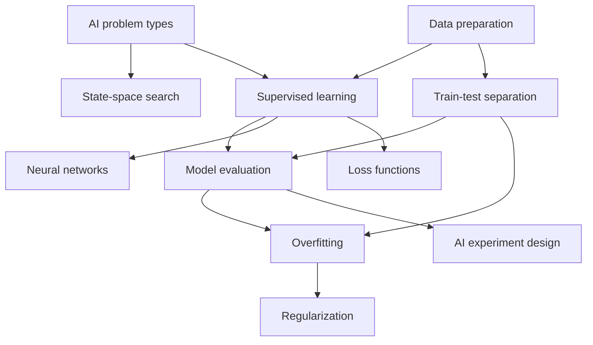

# Constructive alignment — CSS-4008 2026-FALL

Course version `CSS-4008-2026-FALL`, run `CSS-4008-2026-FALL`. Every row must be complete: an outcome that is taught but not assessed produces no evidence, and an outcome that is assessed but not taught is a fairness problem.

## Outcome coverage
| Outcome | Taught in | Practised in | Assessed by | Share of grade | Complete |
| --- | --- | --- | --- | --- | --- |
| LO-01 Explain core AI problem types and methods | MODULE-01, MODULE-02 | ACT-0101, ACT-0202 | CRIT-01-01, CRIT-01-02, CRIT-05-01 | 25% | x |
| LO-02 Implement and evaluate a machine learning model | MODULE-04, MODULE-05, MODULE-06, MODULE-07, MODULE-08, MODULE-11 | ACT-0401, ACT-0501, ACT-0601, ACT-0701, ACT-0801 | CRIT-04-02, CRIT-04-03, CRIT-05-03 | 28% | x |
| LO-03 Prepare and reason about data for learning | MODULE-03, MODULE-05 | ACT-0301, ACT-0501 | CRIT-02-01, CRIT-02-02, CRIT-05-02 | 25% | x |
| LO-04 Design and evaluate an AI solution | MODULE-06, MODULE-09 | ACT-0601, ACT-0602, ACT-0901 | CRIT-04-01, CRIT-04-04, CRIT-05-04 | 22% | x |

## Outcome × assessment
| Outcome | ASSESSMENT-01 | ASSESSMENT-02 | ASSESSMENT-04 | ASSESSMENT-05 |
| --- | --- | --- | --- | --- |
| LO-01 | x | — | — | x |
| LO-02 | — | — | x | x |
| LO-03 | — | x | — | x |
| LO-04 | — | — | x | x |

## Outcome × module
| Outcome | W1 | W2 | W3 | W4 | W5 | W6 | W7 | W8 | W9 | W11 |
| --- | --- | --- | --- | --- | --- | --- | --- | --- | --- | --- |
| LO-01 | x | x | — | — | — | — | — | — | — | — |
| LO-02 | — | — | — | x | x | x | x | x | — | x |
| LO-03 | — | — | x | — | x | — | — | — | — | — |
| LO-04 | — | — | — | — | — | x | — | — | x | — |

## Concept coverage
| Concept | Prerequisites | Taught in | Assessed by |
| --- | --- | --- | --- |
| CONCEPT-AI-PROBLEM-TYPES AI problem types | — | MODULE-01 | CRIT-01-01, CRIT-05-01, ITEM-01-01, ITEM-01-03, ITEM-01-04 |
| CONCEPT-SEARCH State-space search | CONCEPT-AI-PROBLEM-TYPES | MODULE-02 | CRIT-01-02, ITEM-01-03 |
| CONCEPT-DATA-PREPARATION Data preparation | — | MODULE-03 | CRIT-02-01, CRIT-02-02, CRIT-05-02 |
| CONCEPT-SUPERVISED-LEARNING Supervised learning | CONCEPT-AI-PROBLEM-TYPES, CONCEPT-DATA-PREPARATION | MODULE-04 | CRIT-05-03 |
| CONCEPT-TRAIN-TEST-SPLIT Train-test separation | CONCEPT-DATA-PREPARATION | MODULE-05 | CRIT-02-02, CRIT-04-02, CRIT-05-02, ITEM-01-02 |
| CONCEPT-MODEL-EVALUATION Model evaluation | CONCEPT-TRAIN-TEST-SPLIT, CONCEPT-SUPERVISED-LEARNING | MODULE-06 | CRIT-04-02, CRIT-05-03, ITEM-01-02 |
| CONCEPT-OVERFITTING Overfitting | CONCEPT-MODEL-EVALUATION, CONCEPT-TRAIN-TEST-SPLIT | MODULE-06 | CRIT-04-03 |
| CONCEPT-REGULARIZATION Regularization | CONCEPT-OVERFITTING | MODULE-07 | CRIT-04-03 |
| CONCEPT-NEURAL-NETWORKS Neural networks | CONCEPT-SUPERVISED-LEARNING | MODULE-08 | — |
| CONCEPT-EXPERIMENT-DESIGN AI experiment design | CONCEPT-MODEL-EVALUATION | MODULE-09 | CRIT-04-01, CRIT-04-04, CRIT-05-04 |
| CONCEPT-LOSS-FUNCTIONS Loss functions | CONCEPT-SUPERVISED-LEARNING | MODULE-11 | — |

## Capability contribution
| Capability | Fed by |
| --- | --- |
| CAP-AI-EXPERIMENT Design an AI experiment | CRIT-04-01, CRIT-04-02, CRIT-05-04, LO-04 |
| CAP-DATA-REASONING Reason about data | CRIT-02-01, CRIT-05-02, LO-03 |

## Concept graph

---

Generated from the AINAR canonical model. Run `python -m ainar validate` for the machine-checkable version of this report.
